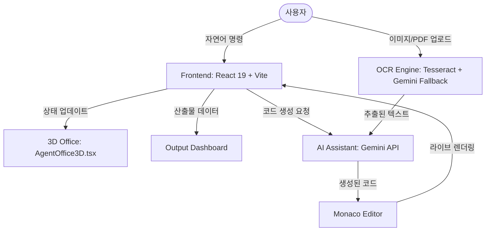

# 시스템 설계 (Design)

본 문서는 분석된 요구사항을 바탕으로 시스템의 아키텍처와 상세 설계를 정의합니다.

## 1. 시스템 구성도 (Excalidraw)

> [!NOTE]
> 모든 구성도는 Excalidraw 형식을 준수합니다. 아래는 시스템 아키텍처의 논리적 구성입니다.

## 2. 상세 컴포넌트 설계

### 2.1 UI/UX 계층
- **기본 폰트**: Pretendard (한글 최적화)
- **테마 시스템**: HSL 기반의 다이내믹 컬러 토큰. `backdrop-filter: blur()` 등을 활용한 글래스모피즘 UI.

### 2.2 OCR 연동 (Zero-Cost Fallback)
1. **Local**: `tesseract.js` (Korean 데이터셋 우선 사용)
2. **Cloud**: Gemini 1.5 Flash/Pro (Free tier) 순차 적용.

### 2.3 3D 오피스 (Asset Reuse)
- `c:\dev\PPTGen\src\components\AgentOffice3D.tsx`의 로직을 상속받아, 현재 프로젝트의 에이전트 상태(`status`) 및 로그(`logs`)와 연동.

## 3. 데이터 흐름
- 사용자의 프롬프트 → AI 분석 → 코드 스니펫 생성 → 실시간 모듈 인젝션 → UI 업데이트.
- 모든 과정은 Documentation Agent에 의해 기록되며 대시보드에 실시간 반영.
